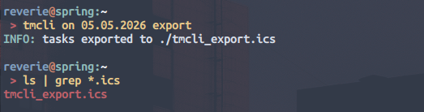
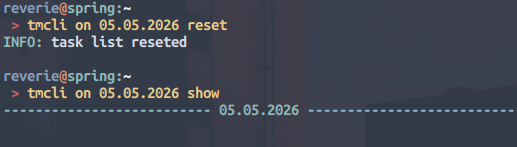

# TMCLI 
Simple CLI Tool to manage and plan Tasks.

## Quick Start
### Requirements
```bash
sudo apt update
sudo apt libical-dev
```

### Build and Installation
```bash
git clone https://github.com/reverie11/tmcli.git
cd tmcli 
./install.sh
tmcli add 15:00 18:00 "learn rust"
```

the installation script `install.sh` adds the build binary to `$HOME/.local/bin/` 
directory which should already be in your `$PATH` so that it is immediately 
executable by running `tmcli`. Similarly, the bash-completion script will be
installed under your `$XDG_DATA_HOME/bash-completion/completions/` dir.

tmcli mantains a state `state-ddmmyyyy.dat`, which by default is stored persistently in
your `$XDG_CACHE_HOME/tmcli/` dir. 

## Overview
```
 > tmcli -h
Usage: tmcli [OPTIONS] [PRE-COMMAND] COMMAND [ARGS...]

OPTIONS
  -v, --verbose              Enable verbose output
  -h, --help                 Show this help message

PRE-COMMAND
  on       DATE              Temporarily set the working date, default is today

COMMAND
  add      STRT ENDT NAME    Add a new task with start-, endtime, and name
  modify   T_ID OBJT TIME    Modify the attribute object of an existing task of specified id
  move     T_ID      TIME    Move anexisting task of a specified id to specified time
  delete   T_ID              Delete an existing task of a specified id
  show                       Show all exisiting tasks
  export                     export all existiing tasks to ICS-Format (.ics)
  reset                      Reset task-list

OBJECTS
  start                       task's starttime
  end                         task's endtime
  name                        task's name

FORMAT
  DATE                       D[D.MM.YYYY]
  TIME                       H[H:MM]

Version  :  v0.2.0
Author   :  reverie11

```

## Demo


 

 

 


## Uninstall
```bash
./uninstall.sh
```
This script will undo the installation script, except the build. Running 
`make clean` can do the build cleaning for you, if you want to save up some
space.
