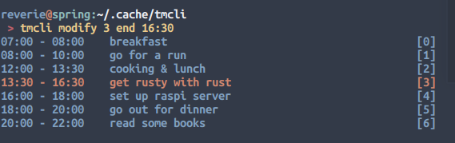
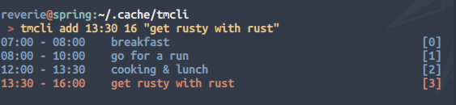
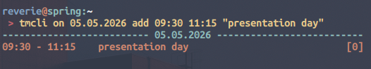

# TMCLI 
Simple CLI Tool to manage and plan Tasks.

## Quick Start
### Requirements
```bash
sudo apt update
sudo apt libical-dev
```

### Build and Installation
```bash
git clone https://github.com/reverie11/tmcli.git
cd tmcli 
./install.sh
tmcli add 15:00 18:00 "learn rust"
```

the installation script `install.sh` add the build binary to `$HOME/.local/bin/` 
directory which should already be in your `$PATH` so that it is immediately 
executable by running `tmcli`.

tmcli mantains a state `state.dat`, which by default is stored persistently in
your `$XDG_CACHE_HOME/tmcli/` or `$HOME/.cache/tmcli/`. 

## Overview
```
 > tmcli -h
Usage: tmcli [OPTIONS] COMMAND [ARGS...]

COMMANDS
  add    START END NAME     Add a new task with starttime START,
                               endtime END, and name NAME
  modify ID OBJ VAL         Modify the start- or endtime of an existing task
  move   ID VAL             Move existing task to different time
  del    ID                 Delete an existing task
  show                      Show all tasks
  export                    export to ICS-Format (.ics)
  reset                     Reset TMCLI's state

OBJECTS
 start                      task's starttime
 end                        task's endtime

OPTIONS
  -v, --verbose             Enable verbose output
  -h, --help                Show this help message

Version  :  1.0.0
Author   :  reverie

```

## Demo




 

## Uninstall
```bash
./uninstall.sh
```
